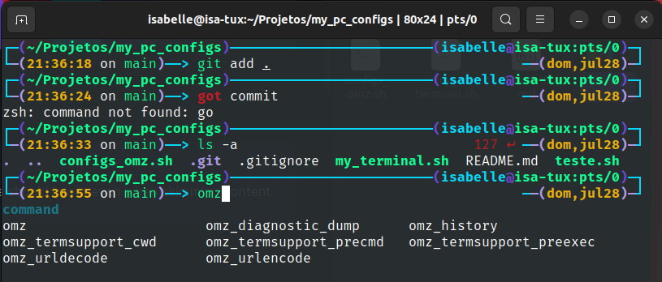

# my_pc_configs
Repo para guardar em scripts meus programas que instalo assim que formato minha máquina.

## Paletas de cores do terminal 

> [!NOTE]
> Fiz a paleta no [Imagecolocarpicker](https://imagecolorpicker.com/)
---

## Programas que costumo instalar:

  

> [!NOTE]
> Useful information that users should know, even when skimming content.

> [!TIP]
> Helpful advice for doing things better or more easily.

> [!IMPORTANT]
> Key information users need to know to achieve their goal.

> [!WARNING]
> Urgent info that needs immediate user attention to avoid problems.

> [!CAUTION]
> Advises about risks or negative outcomes of certain actions.